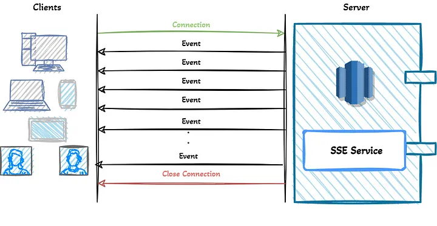

# Server-Sent Events

Server sent events(SSE) is a pushing technology that enables pushing notification/message/events  
from the server to the client(s) via HTTP connection.

This is a simple SSE example sending "1" to all connected clients.  
It also notifies when a new client is connected or disconnected.